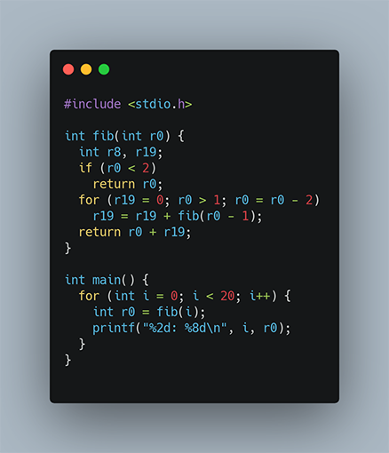

<script type="text/javascript" async src="https://cdn.mathjax.org/mathjax/latest/MathJax.js?config=TeX-MML-AM_CHTML">

# A look at clang and optimization techniques

## Introduction
<p>
I recently wrote a small C-program to do some benchmarking and
when examining the resulting assembler code I was surprised to
see how <tt>clang</tt> had optimized the code.
Here I will report my findings.
</p>
<p>
You are perhaps already familiar with the famous Fibonacci sequence
</p>
<pre>
    0, 1, 1, 2, 3, 5, 8, 13, 21, 34, 55, 89, 144, ...
</pre>
The sequence can be defined recursively:
<pre>
    FIB(0) = 0
    FIB(1) = 1
    FIB(n) = FIB(n-1) + FIB(n-2), for n > 2
</pre>
<p>
Here is the C-program which prints the first 20 Fibonacci numbers:
</p>

<p>
On Mac OS with clang, I then compiled the C-code with <tt>-O3</tt> for
maximum optimization, although <tt>-O2</tt> or <tt>-Os</tt> will generate
the same code for <tt>fib</tt> which is the interesting function here.
So here is the assembler code, translated back to C for readibility.
</p>

<p>
Here, <tt>r0</tt>, <tt>r8</tt>, <tt>r19</tt>, <tt>r20</tt> corresponds
to registers in the M1 ARM processor.  Granted, this is quite a mess
with <tt>goto</tt>-statements but we can see that the two recursive
calls to <tt>fib</tt> have been translated into something with only
one recursive call.  What's going on here?!
</p>
<p>
Let us first clear up the code to get rid of the <tt>goto</tt>-statements.
</p>

<p>
Let's simplify it some more to get rid of a few intermediate variables.
</p>

<p>
A few more steps and we can finally see what's going on.
</p>

<p>
This is markdown with some display math
```math
a^b + b^2 = c^2
```
and some inline math, $`e^{i\pi} + 1 = 0`$.
</p>
