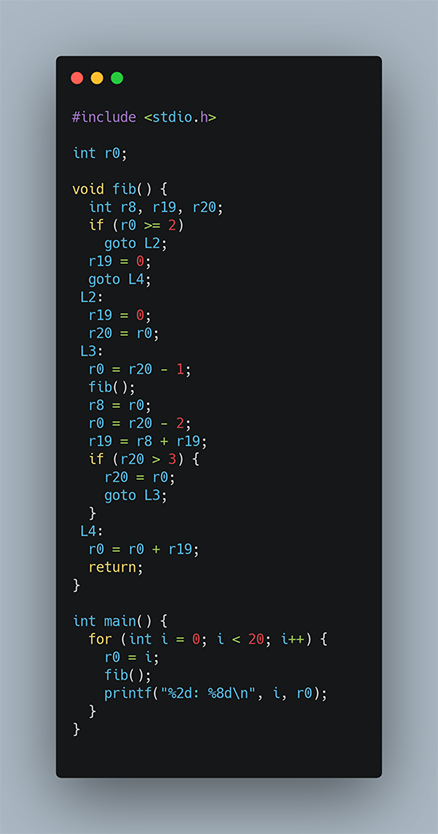

# A look at clang and optimization techniques

## Introduction

I recently wrote a small C-program to do some benchmarking and
when examining the resulting assembler code I was surprised to
see how <tt>clang</tt> had optimized the code.

You are perhaps already familiar with the famous Fibonacci sequence

<pre>
    0, 1, 1, 2, 3, 5, 8, 13, 21, 34, 55, 89, 144, ...
</pre>
Where each number is the sum of the previous two.
The sequence can be defined recursively:
<pre>
    fib(0) = 0
    fib(1) = 1
    fib(n) = fib(n-1) + fib(n-2), for n > 2
</pre>

Here is a C-program which prints the first 20 Fibonacci numbers:

On Mac OS with clang, I compiled this with <tt>-O3</tt> for
maximum optimization, although <tt>-O2</tt> or <tt>-Os</tt> will generate
the same code for <tt>fib</tt> which is the interesting function here.
So here is the assembler code for <tt>fib</tt>,
translated back to C to make it slightly more readable.

Here, <tt>r0</tt>, <tt>r8</tt>, <tt>r19</tt>, <tt>r20</tt> corresponds
to registers in the M1 ARM processor.  Granted, this is quite a mess
with <tt>goto</tt>-statements but we can see that the two recursive
calls to <tt>fib</tt> have been translated into something with only
one recursive call.  What's going on here?!

Let us first clear up the code to get rid of the <tt>goto</tt>-statements.

Let's simplify it some more to get rid of a few intermediate variables.

A few more steps and we can finally see what's going on.

So it seems that <tt>clang</tt> has unfolded
<pre>
    fib(n) = fib(n-1) + fib(n-2)
           = fib(n-1) + fib(n-3) + fib(n-4)
	   = fib(n-1) + fib(n-3) + fib(n-5) + fib(n-6)
	   = fib(n-1) + fib(n-3) + fib(n-5) + fib(n-7) + fib(n-9)
	   :
</pre>

This sum is held in the variable <tt>r19</tt>.
The final value of <tt>r0</tt> (added at the <tt>return</tt>-statement)
is either 0 or 1, depending on the initial value of <tt>r0</tt>
being odd or even.

Notice that <tt>fib</tt> is not tail-recursive, i.e., after the
recursive calls to <tt>fib(n-1)</tt> and <tt>fib(n-2)</tt>,
<tt>fib(n)</tt> must add the values before it itself can return the
final result.  In other words, it would be quite difficult for the
C-compiler to translate <tt>fib</tt> into linear code with no recursion
but perhaps in the future, a compiler would be able to transform the
recursive function into something like this:

2021-12-08 Kjell Post <tt>kjell@irstafoto.se</tt>

